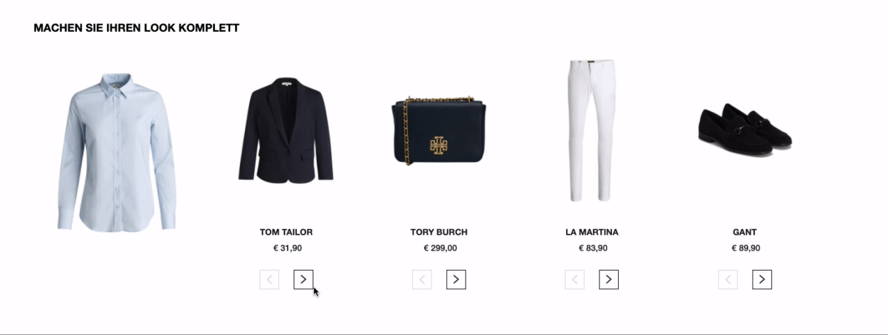

# Example what is not a product interaction

Because our `interact` are the reference events for our commission based pricing we want to make sure you only send interact product events if the user is really interacting with the product and not with something else.  

## Product Carousel

Let's assume you have implemented a product carousel where a user can click or swipe through a list of products. In that case a click or swipe to the next or previous product is definitely not an interact product event.

