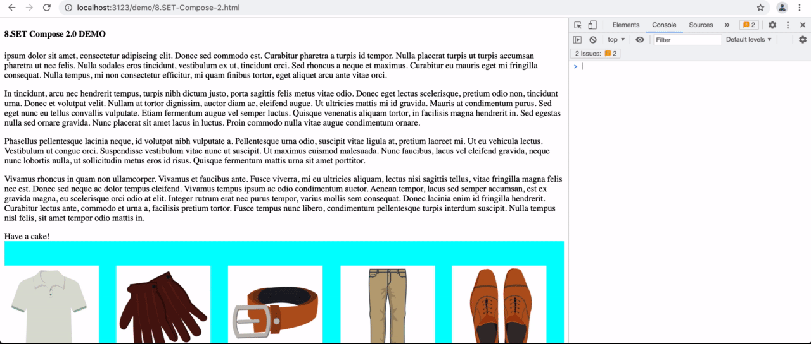

# How to evaluate if view event can be sent

Our KPIs require that a `view` event is only send if the according content is inside the user's viewport.

## Example cases

There are two cases when content is eligible to trigger such an event

### **50% of the content is visible in the viewport**



### **The content is visible on 50% of the viewport**


## **Code Snippet**

```javascript
const getDimensions = node => {
  const nodeOffsetY = node.getBoundingClientRect().top + window.scrollY
  const nodeHeight = node.getBoundingClientRect().height
  const viewOffsetY = window.scrollY
  const viewHeight = window.innerHeight
  return { nodeOffsetY, nodeHeight, viewOffsetY, viewHeight }
}

const isHalfViewFilledByNode = node => {
  const { nodeOffsetY, nodeHeight, viewOffsetY, viewHeight } = getDimensions(node)
  const topNodeIsFillingBottomHalfView = viewOffsetY + viewHeight / 2 >= nodeOffsetY
  const bottomNodeIsFillingTopHalfView = viewOffsetY + viewHeight / 2 <= nodeOffsetY + nodeHeight

  return topNodeIsFillingBottomHalfView && bottomNodeIsFillingTopHalfView
}

const isHalfNodeVisible = node => {
  const { nodeOffsetY, nodeHeight, viewOffsetY, viewHeight } = getDimensions(node)
  const viewBottomIsBelowTopHalfNode = viewOffsetY + viewHeight >= nodeOffsetY + nodeHeight / 2
  const viewTopIsAboveBottomHalfNode = viewOffsetY <= nodeOffsetY + nodeHeight / 2

  return viewBottomIsBelowTopHalfNode && viewTopIsAboveBottomHalfNode
}

export default node => {
  const isNodeHidden = node.offsetParent === null // if one of the parents is display none, this will be null
  const isNodeFixed = node.style.position === 'fixed' // position fixed has no offsetParent

  if (isNodeHidden && !isNodeFixed) {
    return false
  }

  return isHalfViewFilledByNode(node) || isHalfNodeVisible(node)
}
```

