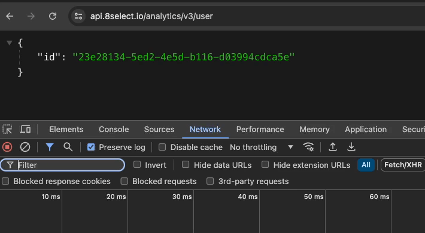

# User Identification

To enable user-based metrics the user has to be identified with a consistent identifier. The identifier is wrapped in a context object and must be consistent for all events concerning a single user:

```javascript
{
  ...,
  "context": [
    {
      "type": "user",
      "user": {
        "id": "c57a43f7-eefc-462b-b5a8-0ef421e90f67" // uuid-v4
      }
    }
  ],	
  ...
}
```

## Getting a user-id from us

We provide a HTTP endpoint you can use to request a user-id. The endpoint will return a JSON payload that includes a uuid-v4.

HTTP GET`https://api.8select.io/analytics/v3/user`

```json
{
  "id": "c243ddce-e122-4532-88bb-460597632640"
}
```


This will only work if you make the request from the client side - i.e. you have to implement this in your frontend and the request has to be send via the user's browser.


The ID generation is e-tag based and will only work on the client side. If the browser cache is emptied we will return a new id.

<figure><figcaption></figcaption></figure>

## Generating your own user-id

In case you want or can generate your own user-id or maybe already have some means to identify a user that is also fine. Just make sure you send us a uuid-v4. In case you already have a value that is not a uuid-v4 you can transform your value as a [uuid-v5](https://www.npmjs.com/package/uuidv5).

Identifying the user has to be done on a best efforts basis. We know that making this work 100% of the time is impossible because users can clear their device cache or change devices or something else to break the consistency.


**User-based metrics** are metrics that actually require to tie an event stream to a certain user.&#x20;

One example is the metric about order lines that are generated through 8SELECT content.&#x20;

To know that specific products where bought because a user interacted with that product via the 8SELECT content all those events need to be tied to that specific user, i.e. need a user id in the context. Otherwise it is not possible to match order events with view or interact events.

