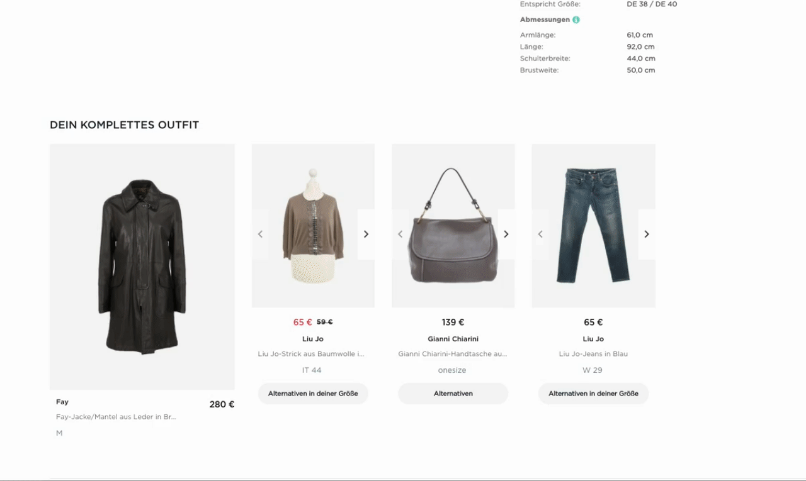

# Product set of 4 with alternatives

## What we want to build

Let's assume we want to show a two-dimensial outfit composer with alternatives to choose from on the product detail page of a given product:



An 8.SET Compose  set consists of a **trigger product** and between two and four additional **set products**.

In the above example, the top left product is our trigger product. It is the product this 8.SET Compose product set was generated for. In most cases this will be the product, on which product details page the set will be shown. The additional slots in the outfit composer show set products with a variety of recommended product alternatives a customer could choose from. This particular 8.SET Compose product set has three recommended set products.

## How it works

The 8SELECT GraphQL API allows you to query information about an 8.SET Compose product set containing identifiers of the products contained in the set. These enable you to subsequently fetch all product data, like prices, images and more, from your own shop APIs to build your custom interface.

There are three `queryTypes`, you can choose from: `SKU`, `MAIN_SKU` and `MODEL_ID`. To learn more about the differences between those identifiers, see [https://docs.8select.io/produktdaten-uebermitteln/stammdaten/details](https://docs.8select.io/produktdaten-uebermitteln/stammdaten/details).

In the following example we are using the `MAIN_SKU` to query a product set and the SKUs of the contained products, as well as their alternatives. The `triggerProduct` and the `setProducts` are two separate fields in the query. Since we already know the SKU of our trigger product and just want to show alternatives for set products, we actually only need to query the latter: 



```graphql
query {
  productSets(input: { queryType: MAIN_SKU, value: "5969155" }) {
    edges {
      node {
        setProducts {
          sku
          alternatives {
            edges {
              node {
                sku
              }
            }
          }
        }
      }
    }
  }
}
```



```bash
curl https://api-demo.8select.io/graphql \
-H 'x-api-id: <Your API ID>'  \
-H 'Content-Type: application/json' \
-d '{"query":"query { productSets(input: {queryType: MAIN_SKU, value: \"5969155\"}) { edges { node { setProducts { sku alternatives { edges { node { sku } } } } } } } }"}'


```



```javascript
{
  "data": {
    "productSets": {
      "edges": [
        {
          "node": {
            "setProducts": [
              {
                "sku": "4874214",
                "alternatives": {
                  "edges": [
                    {
                      "node": {
                        "sku": "2473016"
                      }
                    },
                    {
                      "node": {
                        "sku": "2190659"
                      }
                    },
                    {
                      "node": {
                        "sku": "4093774"
                      }
                    },
                    {
                      "node": {
                        "sku": "3998588"
                      }
                    },
                    {
                      "node": {
                        "sku": "4213148"
                      }
                    },
                    {
                      "node": {
                        "sku": "4059867"
                      }
                    },
                    {
                      "node": {
                        "sku": "4145691"
                      }
                    },
                    {
                      "node": {
                        "sku": "4797685"
                      }
                    },
                    {
                      "node": {
                        "sku": "2922202"
                      }
                    },
                    {
                      "node": {
                        "sku": "4488291"
                      }
                    },
                    {
                      "node": {
                        "sku": "4510399"
                      }
                    },
                    {
                      "node": {
                        "sku": "4422927"
                      }
                    },
                    {
                      "node": {
                        "sku": "3953578"
                      }
                    },
                    {
                      "node": {
                        "sku": "5127370"
                      }
                    },
                    {
                      "node": {
                        "sku": "3748404"
                      }
                    }
                  ]
                }
              },
              {
                "sku": "5535609",
                "alternatives": {
                  "edges": [
                    {
                      "node": {
                        "sku": "182788"
                      }
                    },
                    {
                      "node": {
                        "sku": "5729919"
                      }
                    },
                    {
                      "node": {
                        "sku": "2908545"
                      }
                    },
                    {
                      "node": {
                        "sku": "932301"
                      }
                    },
                    {
                      "node": {
                        "sku": "2937814"
                      }
                    }
                  ]
                }
              },
              {
                "sku": "4222984",
                "alternatives": {
                  "edges": [
                    {
                      "node": {
                        "sku": "4560673"
                      }
                    },
                    {
                      "node": {
                        "sku": "5865383"
                      }
                    },
                    {
                      "node": {
                        "sku": "5216692"
                      }
                    },
                    {
                      "node": {
                        "sku": "3464165"
                      }
                    },
                    {
                      "node": {
                        "sku": "5034798"
                      }
                    },
                    {
                      "node": {
                        "sku": "4983522"
                      }
                    },
                    {
                      "node": {
                        "sku": "5594637"
                      }
                    },
                    {
                      "node": {
                        "sku": "4361908"
                      }
                    },
                    {
                      "node": {
                        "sku": "4706855"
                      }
                    },
                    {
                      "node": {
                        "sku": "6059481"
                      }
                    }
                  ]
                }
              }
            ]
          }
        }
      ]
    }
  }
}
```



Looking at the UI we wanted to build, we we would show one additional tile — next to our trigger product on the left — for each entry in the `setProducts` array. The tiles themselves are sliders, which a user can click through to see all product alternatives for the respecive set product. These correspond to the individual `node` fields in the `edges` array of the set product's `alternatives` field in the response. A button below the tiles allows a user to expand the slider and show multiple product alternatives in a row below the original 8.SET Compose product set. Using these SKUs, you can now fetch the product data and information required for your custom interface from your own shop API. 

