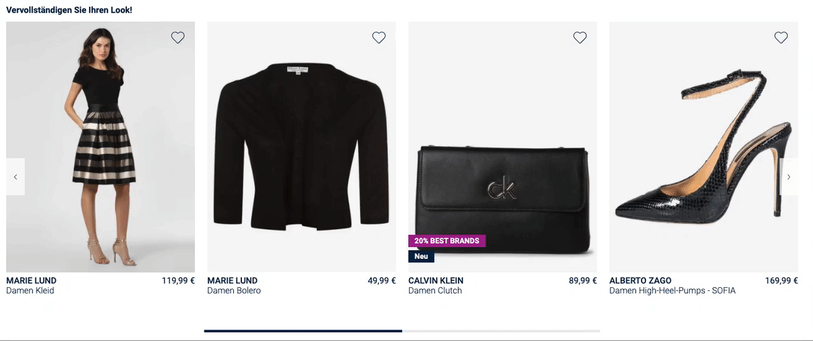

# Product set of 5

## What we want to build

Let's assume we want to show a simple vertical slider of five recommended product combinations on the product detail page of a given product:



An 8.SET Compose  set consists of a **trigger product** and between two and four additional **set products**.

In the above example, the leftmost product is our trigger product. It is the product this 8.SET Compose product set was generated for. In most cases this will be the product, on which product details page the set will be shown. The additional set products in the slider are recommended combinations. This particular 8.SET Compose product set contains four of them.

## How it works

The 8SELECT GraphQL API allows you to query information about an 8.SET Compose product set containing identifiers of the products contained in the set. These enable you to subsequently fetch all product data, like prices, images and more, from your own shop APIs to build your custom interface.

There are three `queryTypes`, you can choose from: `SKU`, `MAIN_SKU` and `MODEL_ID`. To learn more about the differences between those identifiers, see [https://docs.8select.io/produktdaten-uebermitteln/stammdaten/details](https://docs.8select.io/produktdaten-uebermitteln/stammdaten/details).

In the following example we are using the `MAIN_SKU` to query a product set and the SKUs of the contained products:



```graphql
query {
  setCompose(input: { queryType: MAIN_SKU, value: "457297-0001" }) {
    edges {
      node {
        triggerProduct {
          sku
        }
        setProducts {
          sku
        }
      }
    }
  }
}
```



```bash
curl https://api-demo.8select.io/graphql \
-H 'x-api-id: <Your API ID>'  \
-H 'Content-Type: application/json' \
-d '{"query":"query { setCompose(input: {queryType: MAIN_SKU, value: \"457297-0001\"}) { edges { node { triggerProduct { sku } setProducts { sku } } } } }"}'
```



```javascript
{
  "data": {
    "setCompose": {
      "edges": [
        {
          "node": {
            "triggerProduct": {
              "sku": "457297-0001"
            },
            "setProducts": [
              {
                "sku": "476793-0003"
              },
              {
                "sku": "503998-0001"
              },
              {
                "sku": "509250-0002"
              },
              {
                "sku": "450755-0001"
              }
            ]
          }
        }
      ]
    }
  }
}
```



As can be seen, information about the `triggerProduct` must be queried separately. In our case we actually would not even need to query this field, as we already know the SKU of the product beforehand. We were using it to query the 8.SET Compose product set in the first place.

Thus, our query could become as simple as this:



```graphql
query {
  setCompose(input: { queryType: MAIN_SKU, value: "457297-0001" }) {
    edges {
      node {
        setProducts {
          sku
        }
      }
    }
  }
}
```



```bash
curl https://api-demo.8select.io/graphql \
-H 'x-api-id: <Your API ID>'  \
-H 'Content-Type: application/json' \
-d '{"query":"query Query { setCompose(input: {queryType: MAIN_SKU, value: \"457297-0001\"}) { edges { node { setProducts { sku } } } } }"}'
```



```javascript
{
  "data": {
    "setCompose": {
      "edges": [
        {
          "node": {
            "setProducts": [
              {
                "sku": "476793-0003"
              },
              {
                "sku": "503998-0001"
              },
              {
                "sku": "509250-0002"
              },
              {
                "sku": "450755-0001"
              }
            ]
          }
        }
      ]
    }
  }
}
```



Looking at the UI we wanted to build, we would show one additional tile — next to our trigger product on the left — for each entry in the `setProducts` array. Taking the SKUs from the response, you can now fetch the product data and information required for your custom interface from your own shop API. 

