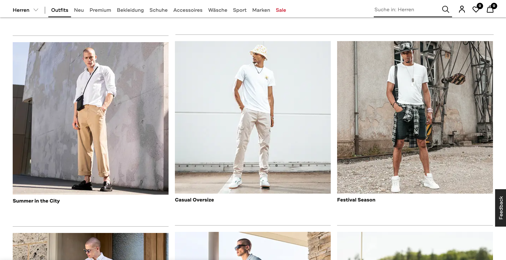
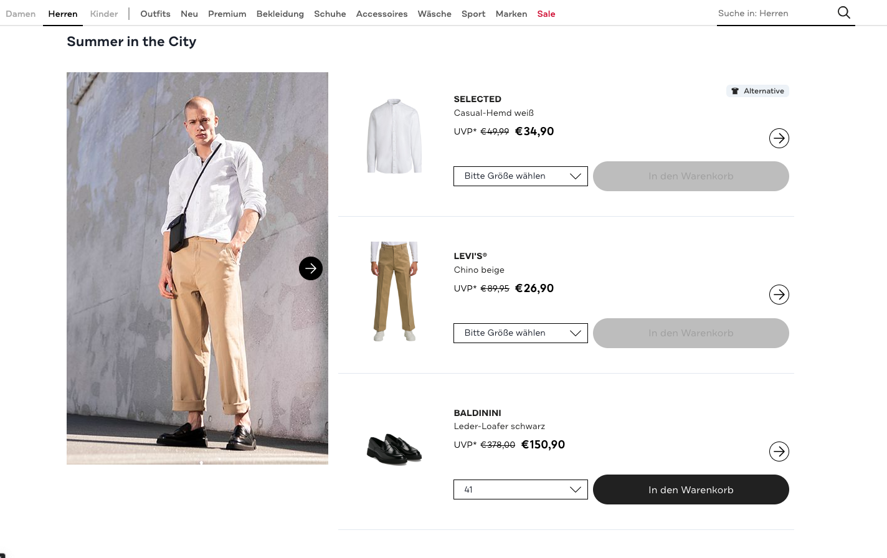

# List available sets

## What we want to build


Although the GraphQL API supports filtering by 8.SET Photo **TAGS**, adding **TAGS** to 8.SET Photo sets is not supported yet by the 8.CONTROL console.


Let's assume we want to show a list of 8.SET Photo sets which fit to the current season and a specific target group, e.g. for the season "summer" and the target group "men":



An 8.SET Photo set consists of a set identifier, title and images.&#x20;

In the above example we show a list of available 8.SET-Photo sets. For each set we show the title and the **Main Gallery Photo** which is the first image of each 8.SET Photo set. A click on any set will forward the user to the detailed view of one set.&#x20;

## How it works

The 8SELECT GraphQL API allows you to query information about 8.SET Photo sets containing identifiers of the sets. These enable you to display the 8.SET Photo widget for specific sets, see [8.set-photo.md](../../../widgets/8.set-photo.md "mention").

With the `queryType TAGS` you can filter the 8.SET Photo sets. The individual`TAGS` can be included as well as excluded.


If the query input `TAGS` is set, either include or exclude must contain at least one value to filter for!


In the following example we are using the `TAGS` to query 8.SET photo sets which include the `TAGS` **"summer"** and **"men"**. Additionally we limit the number of sets to the `first` 10 sets:



```graphql
query {
  setPhoto(first: 10, input: {queryType: TAGS, value: {exclude: [], include: ["summer", "men"]}}) {
    edges {
      node {
        id
        images {
          edges {
            node {
              url
            }
          }
        }
        tags
        title
      }
    }
    pageInfo {
      endCursor
      hasNextPage
    }
  }
}

```



```bash
curl https://api.8select.io/graphql \
-H 'x-api-id: <Your API ID>'  \
-H 'Content-Type: application/json' \
-d '{"query":"query {\n  setPhoto(first: 10, input: {queryType: TAGS, value: {exclude: [], include: [\"summer\", \"men\"]}}) {\n    edges {\n      node {\n        id\n        images {\n          edges {\n            node {\n              url\n            }\n          }\n        }\n        tags\n        title\n      }\n    }\n    pageInfo {\n      endCursor\n      hasNextPage\n    }\n  }\n}\n"}'
```



```javascript
{
  "data": {
    "setPhoto": {
      "edges": [
        {
          "node": {
            "id": "95405aba-4eb5-45dc-93d8-1c13bd5c5d49",
            "tags": ["summer","men"],
            "title": "Summer style inspiration",
            "images": {
              "edges": [
                {
                  "node": {
                    "url": "..."
                  }
                },
                {
                  "node": {
                    "url": "..."
                  }
                }
              ]
            }
          }
        },
        {
          "node": {
            "id": "d873cc15-f3ed-4d34-b313-288ead41f9a8",
            "tags": ["men","summer","beach"],
            "title": "Beach look",
            "images": {
              "edges": [
                ...
                {
                  "node": {
                    "url": "..."
                  }
                }
              ]
            }
          }
        },
        ...
      ],
      "pageInfo": {
        "endCursor": "796fd67b-4434-4eb7-b2ee-cc049e0ed686",
        "hasNextPage": true
      }
    }
  }
}
```



If a user selects one of the displayed 8.SET Photo sets we can redirect the user to a page with a more detailed view of the set. To show the complete 8.SET Photo set we have to add the 8SELECT widget element with the corresponding set identifier (`id`):

```markup
<div data-8select-widget-id="8.SET-photo" data-set-id="95405aba-4eb5-45dc-93d8-1c13bd5c5d49"></div>
```


