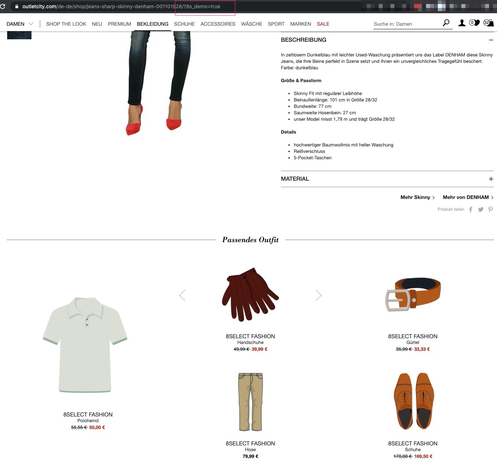

# Demo-Modus

Um die Integration von SDK + Widgets zu testen, kann das SDK in den Demo-Modus versetzt werden. Um den Demo-Modus zu aktivieren, muss in der Shop URL der Parameter `8s_demo=true` gesetzt werden.

