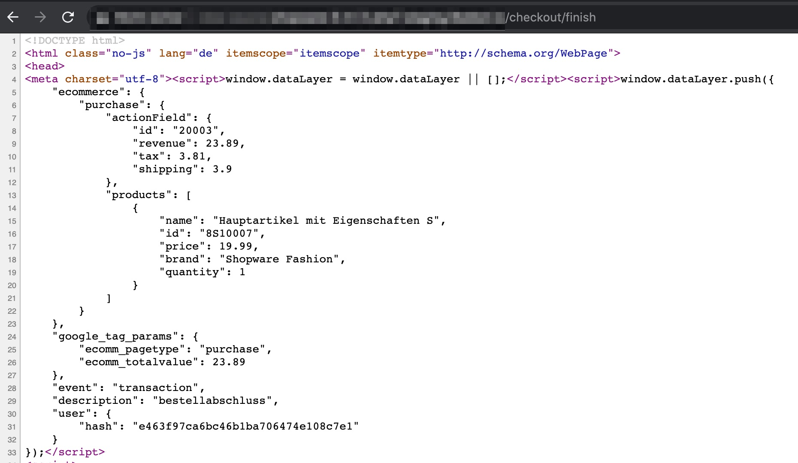
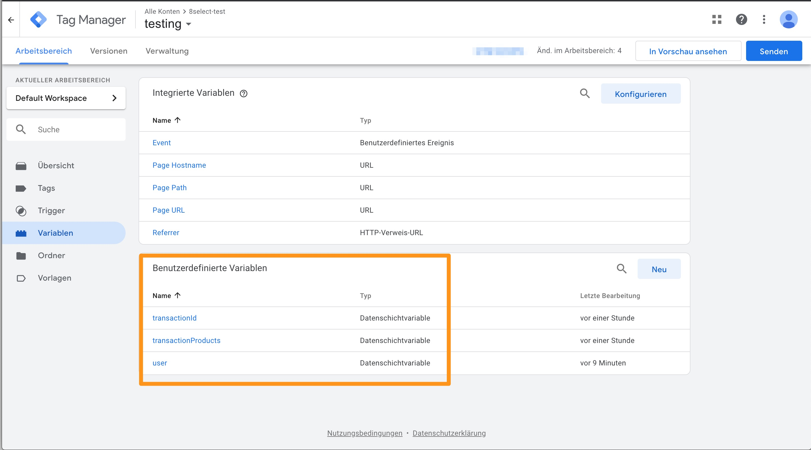
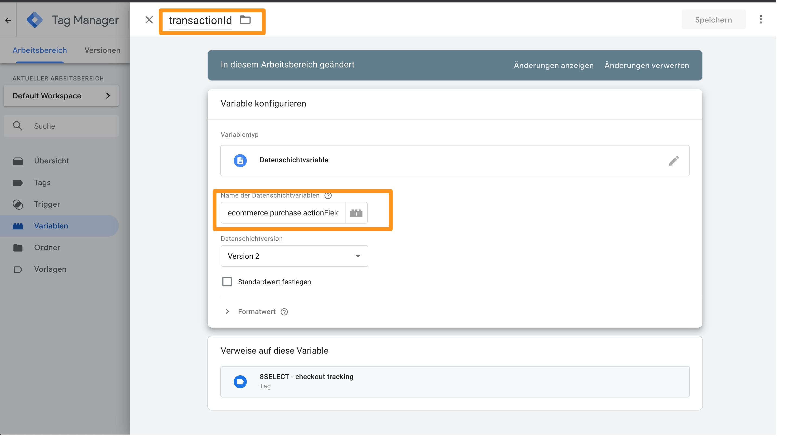
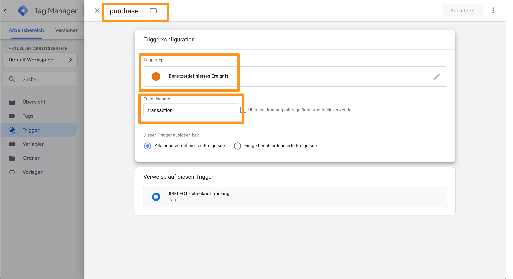
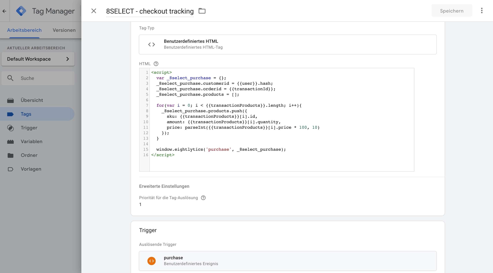
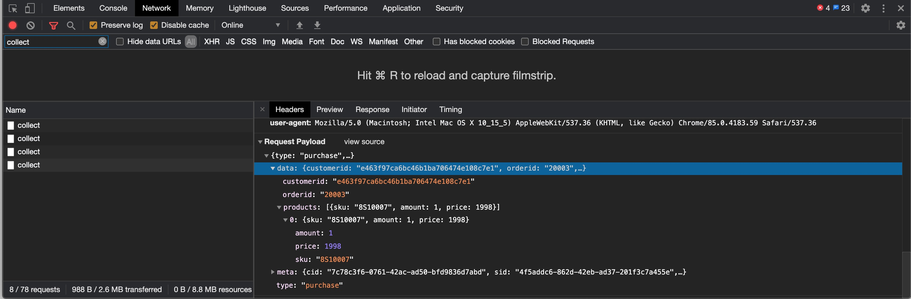

# Tracking Snippet

Für die Auswertung der Umsätze die über die 8select-CSE kommen, müssen Sie das [**SDK**](../integration/#wie-wird-die-8select-cse-integriert) **einbinden** und **zusätzlich einen zweiten** JavaScript Codeausschnitt. Dies muss auf der Seite die nach einem erfolgreichen Checkout angezeigt wird erfolgen.

## Standard Integration

Der Codeausschnitt muss im HTML an beliebiger Stelle nach dem Codeausschnitt für das Laden des 8select.CSE JavaScript-SDKs eingefügt werden.


**ACHTUNG** - Preise müssen in Cent übertragen werden.  
Für ein Artikel für `199,95 €` muss der Wert `19995`übertragen werden.


```javascript
<script type="text/javascript">
    //code für das 8select-CSE JavaScript-SDK - siehe anderes Snippet
</script>
<script type="text/javascript">
  window.eightlytics(
    'purchase',
      {
        customerid: '1234',
        orderid: '1234',
        products: [
          {
            sku: '12345',
            amount: 3,
            price: 1199
          },
          {
            sku: '456',
            amount: 1,
            price: 19995
          }
        ]
    }  
  );
</script>
```

## Integration via Tag Manager - zum Beispiel GTM

Eine Integration via \(Google\) Tag Manager ist mit dem obigen Snippet problemlos möglich. Die entsprechenden Werte werden dann einfach aus dem GTM Data Layer befüllt. Auch hier bitte beachten, dass die Preise in Cent übertragen werden müssen.

### Beispiel GTM

Für das Tracking wird folgendes benötigt:

* GTM Trigger
* GTM Tag
* GTM Variablen befüllt aus data layer

#### **Data Layer**

Damit das Tracking via GTM funktioniert, werden folgende Daten im GTM data layer benötigt:

* event `transaction`
* \(anonymisierte\) Kundennummer - zum Beispiel in `user`
* \(anonymisierte\) Auftragsnummer - zum Beispiel in `transactionId`
* Produkte des Auftrags - zum Beispiel in `transactionProducts`
  * Preis
  * Menge
  * SKU



#### **Übersicht Variablen**



**Variable `user`**


**Variable `transactionId`**



**Variable `transactionProducts`**


#### Trigger



#### Tag



```javascript
<script type="text/javascript">
    // Sollte das 8select-CSE JavaScript-SDK noch nicht anderweitig eingebunden sein
    // so muss dies vor dem Checkout Snippet passieren.
    // Siehe JavaScript SDK - Integration
</script>
<script>
  var _8select_purchase = {};
  _8select_purchase.customerid = {{user}}.hash;
  _8select_purchase.orderid = {{transactionId}};
  _8select_purchase.products = [];
  
  for(var i = 0; i < {{transactionProducts}}.length; i++){
    _8select_purchase.products.push({
      sku: {{transactionProducts}}[i].id,
      amount: {{transactionProducts}}[i].quantity,
      price: parseInt({{transactionProducts}}[i].price * 100, 10)
    });
  }

  window.eightlytics('purchase', _8select_purchase);
</script>
```

#### Ergebnis prüfen



