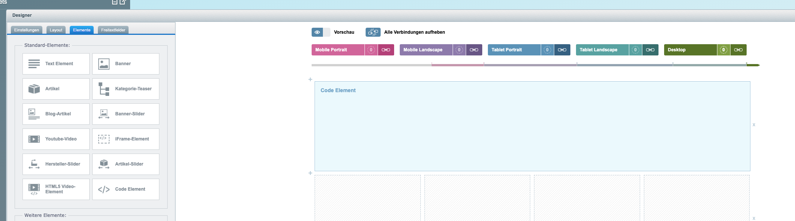
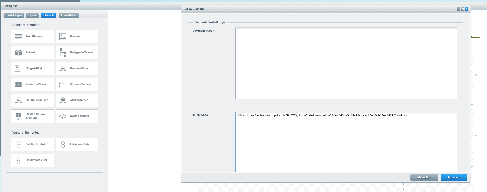
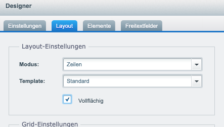
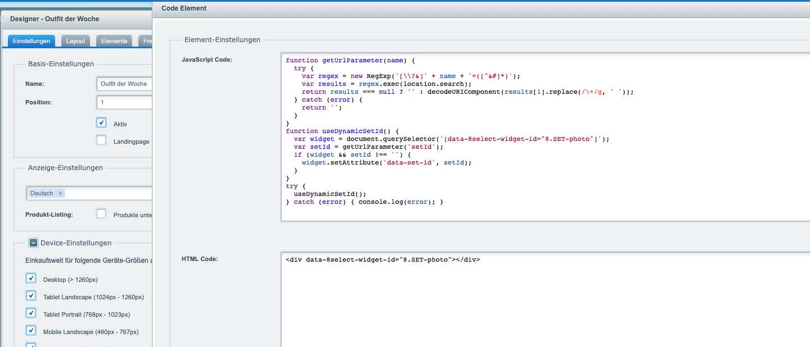

# 8.SET Photo \(Beta\)

## Beispiel


## Widget-Element

```text
<div data-8select-widget-id="8.SET-photo" data-set-id="de5d6599-56f9-4b13-abfd-3e18ef75f95b"></div>
```

`data-set-id` ist der Identifikator eines Photo-Sets. Diesen finden sie in 8.CONTROL im Modul Photo Set Manager.


Da sich 8.SET Photo aktuell in einer Beta-Phase befindet wird das Widget nur auf Anfrage aktiviert. Bitte sprechen Sie mit Ihrem Account Manager.


## Warenkorb Anbindung

Für die Warenkorb Funktion muss wie unter [Warenkorbanbindung](../javascript-sdk/warenkorbanbindung.md) beschrieben eine JavaScript Funktion zur Verfügung gestellt werden.

## Integration in Shopware

Eine Integration in Shopware kann zum Beispiel über die Einkaufswelten erfolgen. Hierzu wird über ein Code-Element einfach das Widget-Element wie oben beschrieben eingefügt.








Für die Integration des JavaScript SDK in Shopware steht ein Plugin im [Shopware Store ](https://store.shopware.com/cse5145762002271f/8select-cross-selling-mittels-set-erstellung.html)bereit.


### Dynamische Set-ID

Um verschiedene Sets mit nur einer Landingpage zu nutzen, kann mit Hilfe von JavaScript die Set-ID dynamisch gesetzt werden.  
Beispielaufruf `https://www.mein-shop.de?setId=a72f398f-9dc8-4712-8ba8-b33a63717b17`.

```text
function getUrlParameter(name) {
  try {
    var regex = new RegExp('[\\?&]' + name + '=([^&#]*)');
    var results = regex.exec(location.search);
    return results === null ? '' : decodeURIComponent(results[1].replace(/\+/g, ' '));
  } catch (error) {
    return '';
  }
}
function useDynamicSetId() {    
  var widget = document.querySelector('[data-8select-widget-id="8.SET-photo"]');
  var setId = getUrlParameter('setId');
  if (widget && setId !== '') {
    widget.setAttribute('data-set-id', setId);
  }
}
try {
  useDynamicSetId();
} catch (error) { 
  console.log(error); 
}

```



  


