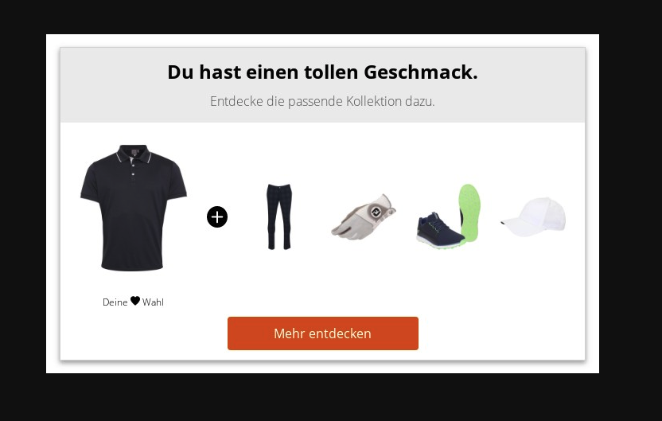

# 8.SET Mail \(Beta\)

Mit Hilfe von 8.SET Mail kann ein Produkt-Set passend zu einer Liste von Artikeln in eine E-Mail eingebunden werden. Unsere APIs liefern ein Bild von dem Produkt-Set sowie einen Link über den der Kunde auf die Artikeldetailseite mit dem soeben gezeigten Produkt-Set kommt.

Das Produkt-Set Bild ist in 3 verschiedenen Auflösungen abrufbar, so dass mit Hilfe von CSS je nach Gerät eine passende Größe angezeigt wird.


Aktuell ist der Touchpoint noch in der Beta-Phase. Das heißt wir können mit Hilfe von Feedback auch noch sehr schnell Anpassungen vornehmen.




Produkt-Set als Bild abrufen



Gibt ein Produkt-Set als Bild in der angefragten Größe zurück.






API ID aus MCON



small \| medium \| large - Größe des Bildes





1-n Komma separierte SKUs  
z.Bsp. aus einer Bestellung



Unique ID - über diese kann der entsprechende Link zum Produkt-Set abgerufen werden.







Wenn ein Produkt-Set gefunden wird.


```
Produkt-Set als Bild.
```




Wenn kein Produkt-Set gefunden wird.


```
1x1 weißes Bild.
```









Weiterleitung zum Produkt-Set abrufen



Gibt eine Weiterleitung für die angefragte `id` zurück.






API ID aus MCON



Unique ID - diese muss auch für das abrufen des Produkt-Set Bildes benutzt werden.







Weiterleitung zum Produkt-Set.


```http
location: https://www.all4golf.de/golfbekleidung-herren/polos/cross-poloshirt-neo-kurzarm-navy-6750293?number=6750293&scrollToSet=1
```






Parameter zum Beispiel für das User Tracking hinterlegen wir aktuell individuell in unserem Backend. Bitte sprechen Sie mit uns.


