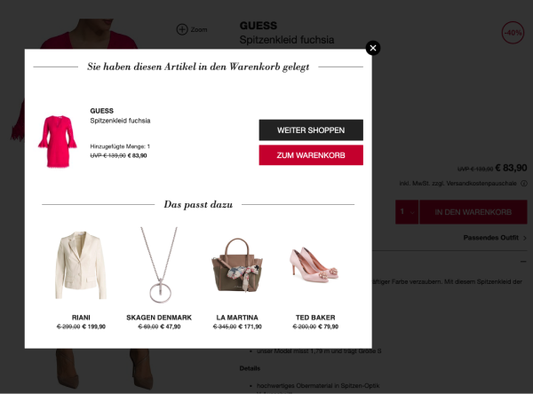

# 8.SET Flat



## Widget-Element

```markup
<div data-8select-widget-id="sys-acc" data-sku="42" data-include-css="true"></div>
```

### Parameter

`data-sku` ist die SKU des aktuellen Artikels. Die CSE sucht basierend darauf ein Produktset welches diesen Artikel enthält. Der Wert für `data-sku` muss dynamisch gesetzt werden und muss eine der im  [Produktexport](../../produktdaten-uebermitteln/datenuebermittlung/rest-api-pull-prinzip/api-spezifikation/abfrage-von-produktdaten.md) übergebenen SKU entsprechen.

`data-include-css` kann `true` oder `false` sein. Wird der Wert weggelassen, entspricht das dem Wert `false`. Steht der Wert auf `true` so wird ein Basis CSS für ein CSS-Grid basierend auf [https://purecss.io/grids/](https://purecss.io/grids/) ausgeliefert. Außerdem werden CSS Deklarationen für einzelne Elemente ausgeliefert. Kommen neue Elemente hinzu werden diese z.B. über die Deklaration `display:none` ausgeblendet.

### CSS Klassen

Folgende CSS Klassen sind nutzbar. Für manche Klassen sind Standardwerte gesetzt. Diese können mit Hilfe von `!important` überschrieben werden.

```css
.-eightselect-item-list {
}

.-eightselect-item {
}

.-eightselect-item-image {
}

.-eightselect-item-body {
}

.-eightselect-item-brand {
}

.-eightselect-item-name {
  display: none;
}

.-eightselect-item-sales-price {
}

.-eightselect-item-stroke-price {
}
```

### Beispiel für Anpassungen via CSS

Folgendes CSS Beispiel fügt ein Eurosymbol \(€\) vor dem Preis ein, formatiert den UVP durchgestrichen und transformiert die Marke zu Großbuchstaben. Außerdem werden der UVP und Angebotspreis nebeneinander dargestellt und Bilder werden zentriert.

```css
.-eightselect-item-image,
.-eightselect-item-body {
    text-align: center;
}
.-eightselect-item-brand {
    text-transform: uppercase;
}
.-eightselect-item-stroke-price {
    text-decoration: line-through;
}
.-eightselect-item-sales-price,
.-eightselect-item-stroke-price {
    display: inline-block;
}
.-eightselect-item-sales-price::before,
.-eightselect-item-stroke-price::before {
    content:"€ ";
}
```

### Beispiel Antwort vom Endpunkt

Das HTML des zurückgelieferten Widgets hat folgende Struktur:

```markup
<div class="-eightselect-item-list -eightselect-g">
    <div class="-eightselect-item -eightselect-u-1-4">
        <a href="#">
            <div class="-eightselect-item-image">
                
            </div>
            <div class="-eightselect-item-body">
                <div class="-eightselect-item-brand">Hugo Boss</div>
                <div class="-eightselect-item-name">Sakko</div>
                <div class="-eightselect-item-stroke-price">299,99</div>
                <div class="-eightselect-item-sales-price">249,99</div>
            </div>
        </a>
    </div>
    <div class="-eightselect-item -eightselect-u-1-4">
        <a href="#">
            <div class="-eightselect-item-image">
                
            </div>
            <div class="-eightselect-item-body">
                <div class="-eightselect-item-brand">Hugo Boss</div>
                <div class="-eightselect-item-name">Sakko</div>
                <div class="-eightselect-item-stroke-price">299,99</div>
                <div class="-eightselect-item-sales-price">249,99</div>
            </div>
        </a>
    </div>
    <div class="-eightselect-item -eightselect-u-1-4">
        <a href="#">
            <div class="-eightselect-item-image">
                
            </div>
            <div class="-eightselect-item-body">
                <div class="-eightselect-item-brand">Hugo Boss</div>
                <div class="-eightselect-item-name">Sakko</div>
                <div class="-eightselect-item-stroke-price">299,99</div>
                <div class="-eightselect-item-sales-price">249,99</div>
            </div>
        </a>
    </div>
    <div class="-eightselect-item -eightselect-u-1-4">
        <a href="#">
            <div class="-eightselect-item-image">
                
            </div>
            <div class="-eightselect-item-body">
                <div class="-eightselect-item-brand">Hugo Boss</div>
                <div class="-eightselect-item-name">Sakko</div>
                <div class="-eightselect-item-stroke-price">299,99</div>
                <div class="-eightselect-item-sales-price">249,99</div>
            </div>
        </a>
    </div>
</div>
```

## **API**

### **Asynchrone Einbindung**

Wird ein **8.SET Flat** dynamisch erzeugt bzw. asynchron geladen, so kann es passieren, dass das Widget zu spät dem DOM hinzugefügt wird. Um die Funktion des Widgets zu trigger, muss nachdem hinzufügen zum DOM das JS SDK darüber informiert werden.

```javascript
// failsafe if the JS SDK is not yet injected
if (typeof _8select === "undefined") {
  return
}
// activate 8.SET Flat widget
_8select.initCSE();
```

### Callback

Im Erfolgs- bzw. Fehlerfall wird `window._eightselect_config['sys-acc'].callback` aufgerufen sofern eine Funktion definiert ist.

#### Beispiel

```javascript
_eightselect_config = _eightselect_config || {}
_eightselect_config['sys-acc'] = {
  callback: function (error, sku, widgetUuid) {
    if (error) {
      // something went wrong or no set was found for given sku
      functionToShowFallbackElement()
      return
    }
    // everything fine and a set was found for given sku
    trackAnEventWithYourFavouriteTool()
  }
}
```

