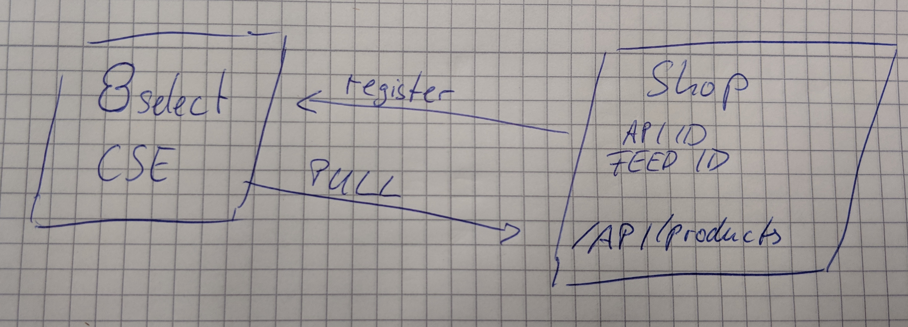

# Einleitung

Damit die 8select.CSE in einem Shop nutzbar ist, muss sich der Shop mit der CSE verbinden.  
Dabei wird zum Beispiel die Shop URL übertragen aber auch die Informationen darüber wie und wo die 8select.CSE die Produktdaten des Shops abfragen kann.


Der Endpunkt muss immer dann aufgerufen werden, wenn sich die zu übertragenden Informationen ändern. Also zum Beispiel wenn die Shop Software aktualisiert wird, wenn das 8select Plugin aktualisiert wird oder wenn sich Einstellungen am 8select Plugin ändern.


### Authentifizierung

Der Endpunkt prüft die Legitimität der Anfrage in dem die im  Request Header gesendeten Werte für **`<API-ID>`** und **`<FEED-ID>`** abgeglichen werden.

