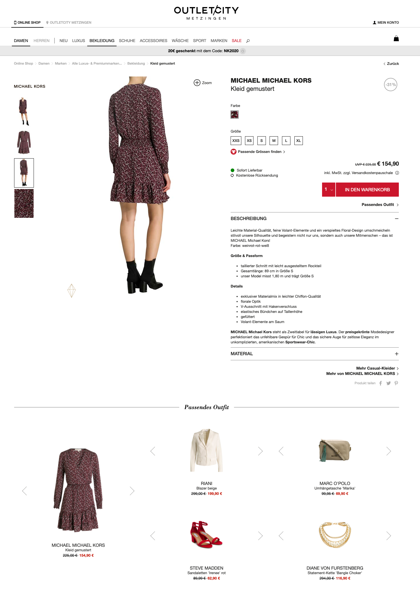
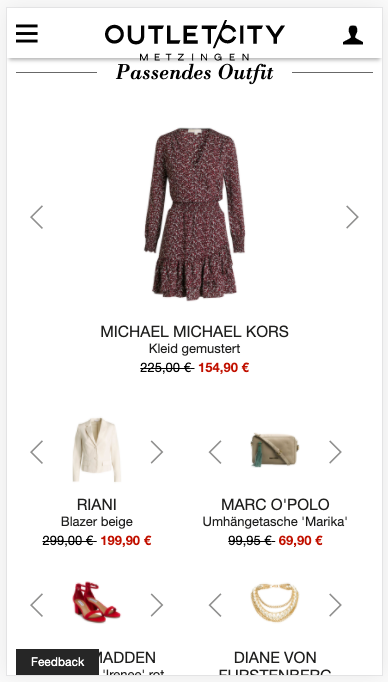

# 8.SET Compose






## Widget-Element

**Show matching product set for a given SKU or Main-SKU**

```markup
<div data-8select-widget-id="sys-psv" data-sku="42"></div>
```

* `data-sku` is a dynamic attribute
  * its value is the [SKU](../produktdaten-uebermitteln/stammdaten/details.md#sku-sku) or [Main-SKU](../produktdaten-uebermitteln/stammdaten/details.md#main-sku-main-sku) of the product variant the customer is viewing in the shop
  * the [SKU](../produktdaten-uebermitteln/stammdaten/details.md#sku-sku) or [Main-SKU](../produktdaten-uebermitteln/stammdaten/details.md#main-sku-main-sku) has to be the same value that is used in the [product export](../integration/produkt-export.md)

## API

### Update SKU in case of non-size variant change

The played out content is specific to visual variants such as colour or pattern.   
To retrieve the content of the currently selected visual variant, the current SKU must be passed to the widget when the visual variant is changed. For example if a customer is currently viewing the red variant of a shirt and changes to the blue variant, the 8.SDK has to be informed about the changed SKU to load content for the changed visual variant.  
  
This must not happen when changing the size, as the content is size-independent.

```javascript
window._8select.reinitSys('<new-sku>')
```

