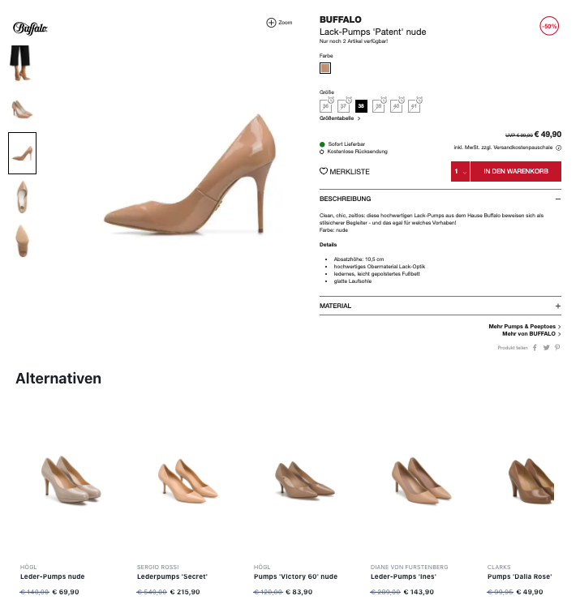

# 8.SIMILAR



## Widget-Element

### **Show alternative products for a given SKU or Main-SKU**

```markup
<div data-8select-widget-id="8.SIMILAR" data-sku="42"></div>
```

* `data-sku` is a dynamic attribute
  * its value is the [SKU](../produktdaten-uebermitteln/stammdaten/details.md#sku-sku) or [Main-SKU](../produktdaten-uebermitteln/stammdaten/details.md#main-sku-main-sku) of the product variant the customer is viewing in the shop
  * the [SKU](../produktdaten-uebermitteln/stammdaten/details.md#sku-sku) or [Main-SKU](../produktdaten-uebermitteln/stammdaten/details.md#main-sku-main-sku) has to be the same value that is used in the [product export](../integration/produkt-export.md)

